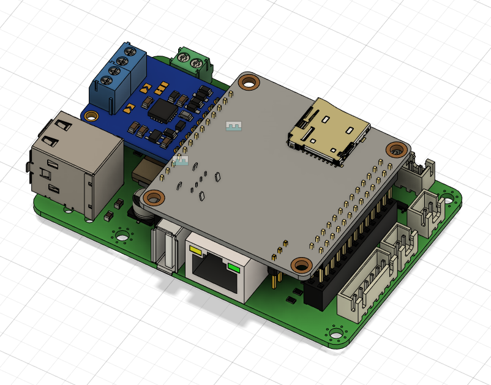
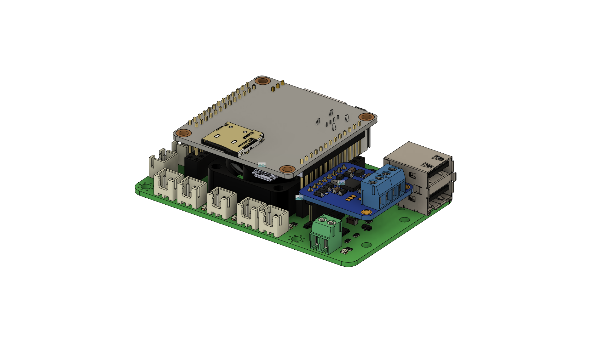
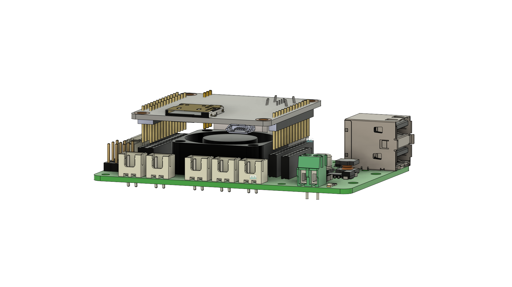
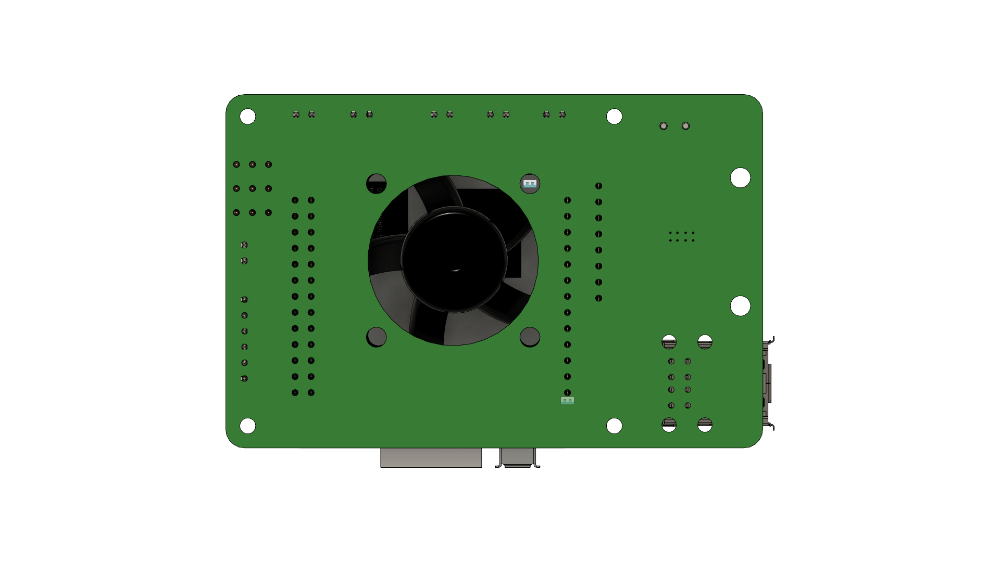

**(!) 当前版本尚未完成验证测试，请暂时不要使用！目前只是为了做版本控制而放置在这。**
**(!) Current version is still under verifying, DO NOT use it at this moment! I just upload files here for version control**

# 开始之前 Before you start 
- 我并不是专业的电子工程师，设计本项目只是为了好玩和方便我DIY Voron 3D打印机。
- 你将自行承担由此带来的所有风险
- 社区已经有诸多反馈香橙派zero的CPU温度过高，所以在使用中请加强散热
- **(!) 请特别注意文章中加粗和带"(!)"部分的内容**
- I'm not a prefesstional electronic engineer, I designed this for fun and convenience while DIY my Voron printer
- You will take it as your own risk for any potential damages
- OrangePi Zero H2+ CPU is being reported has overheat issue, hence a proper cooling fan even with cooling fin is strongly recommended
- **(!) Please pay attention for the bold font and description with "(!)"**

# 代号：橙汁 Board Name: Orange Juice
受全球芯片短缺情况影响，树莓派价格涨到了离谱的位置。
所以香橙派zero成了一个很好的替代品。120元左右的512MB版本可以满足做为klipper宿主的所有需求，甚至有点性能过剩。

Due to current chipset shortage sitatuion, raspberry pi price increase to an unreasonable level. 
Hence OrangePi Zero become a good alternative. A 25 dollars 512MB ram version meets all the requirments I need as a klipper host for my Voron V0.1, and actually even little bit over kill.

klipper有诸多独特的功能需要使用到gpio针脚，每次都用排母端子去连接非常的不方便。在使用扩展板后不仅方便了许多，且可以得到额外的功能：

Klipper has some advance features which need connect to gpio pins, it's not that convenience to use a pin header to connect gpio pin every time. Instead of that, with this board, it provides easier connection and more useful features:

- 一个专为[ADXL345](https://www.adafruit.com/product/1231) 设计的接口将香橙派SPI1总线引出
- 一个专为[adafruit MAX31865 board](https://www.adafruit.com/product/3328) 及其克隆版本设计的接口，作为软SPI使用了4个gpio接口
- 两个从香橙派引出的USB2.0 TypeA接口
- 一个UART接口
- 三组gpio控制的PWM输出接口，输出电压与输入电压相同
- 两组恒定5v输出接口
- 一个香橙派专用散热3010风扇安装位
- 预制降压电路，将9~28V输入电压降压为5V供香橙派使用
- 扩展板大小及安装孔位与树莓派3/4一样
- A dedicate [ADXL345](https://www.adafruit.com/product/1231) port is extended from OrangePi zero SPI1 bus
- A dedicate MAX31865 port connect to 4 gpio pins as a SW SPI connection, for [adafruit MAX31865 board](https://www.adafruit.com/product/3328)
- Two USB2.0 Type A ports are extended from orange pi function pin
- A UART port for UART communication with printer MCU board
- Three klipper controllable pwm output ports, voltage depends on input DC voltage
- Two channel persistent 5v output
- A build in 3010 chip cooling fan position
- A build in step-down buck converter to convert DC 9~24v input to DC 5v to supply pi and 5v output socket
- Raspberry Pi 3B/4 board size and mount hole position compatible 

  

  

  

  

# 如何使用 How to use

## 硬件 Hardware

## 软件 Software

# 采购单 BOM

