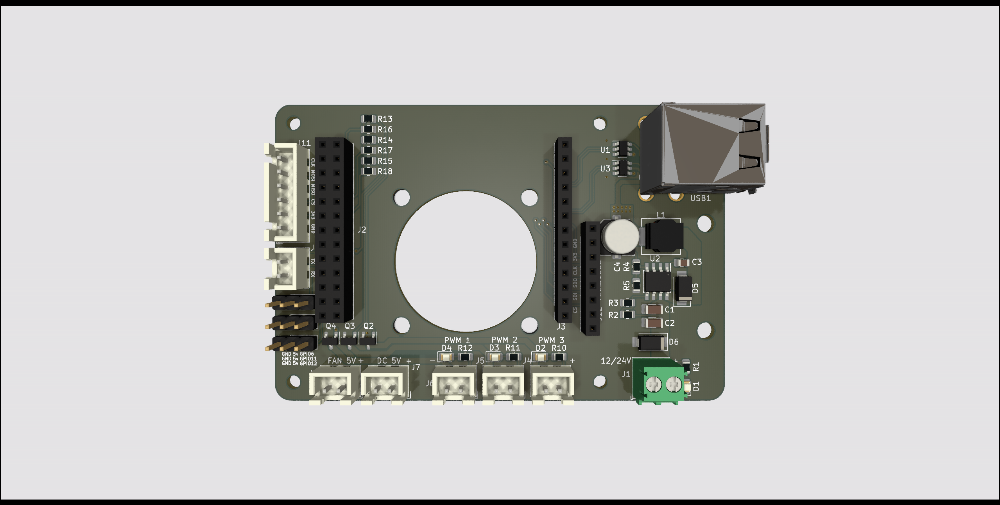
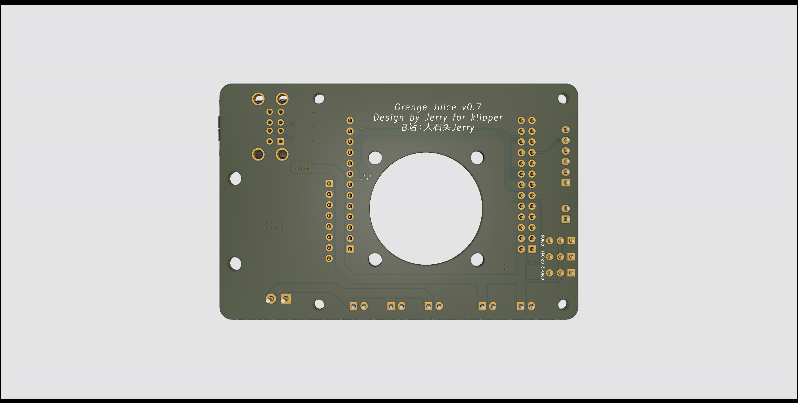

# 我的频道 My Channel 
youtube: https://www.youtube.com/channel/UChTFW-Y9eg54AaTY_yama7A \
bilibili：https://b23.tv/pqzW2up

# 版本信息 Release Note
2022/02/06: v0.7 bate release version, passed function and stable test.

# 开始之前 Before You Start 
- 我并不是专业的电子工程师，设计本项目只是为了好玩和方便DIY Voron 3D打印机
- 你将自行承担由此带来的所有风险
- 社区有诸多反馈香橙派zero的CPU温度过高，所以在使用中请加强散热
- 本项目为基于GPL3.0的开源项目，欢迎魔改。如果你有更好的改进也请务必与我分享 
- **尽管本项目基于GPL3.0，但本人保留本项目涉及到软硬件、外观、名称等所有权，未授权情况下严禁用于任何商业目的**
- **(!) 请特别注意文章中加粗和带"(!)"部分的内容**

- I'm not prefesstional electronic engineer, I designed this for fun and convenience while DIY my Voron printer
- You will take it as your own risk for any potential damages
- Overheat issue is being reported for OrangePi Zero H2+ CPU, hence a proper cooling fan even with cooling fin is strongly recommended
- This project is based GPL3.0 license, you are free to modify it to yourown version. Please do share the joy with me if you did that
- Even this project is based on GPL3.0, all rights are reserved include hardware, software, logo etc. Commerial usage is not allowed without authorization.
- **(!) Please pay attention for the bold and with "(!)" content**

# 代号：橙汁 BoardName：Orange Juice

  

  

受全球芯片短缺情况影响，树莓派价格涨到了离谱的位置。
所以香橙派zero成了一个很好的替代品。120元左右的512MB版本可以满足做为klipper宿主的所有需求，甚至有点性能过剩。

klipper有诸多独特的功能需要使用到gpio针脚，每次都用排母端子去连接非常的不方便。在使用扩展板后不仅方便了许多，且可以得到额外的功能：
- 一个专为[ADXL345](https://www.adafruit.com/product/1231) 设计的接口将香橙派SPI1总线引出
- 一个专为[Adafruit MAX31865 board](https://www.adafruit.com/product/3328) 及其克隆版本设计的接口，作为软SPI使用了4个gpio接口
- 两个从香橙派引出的USB2.0 TypeA接口
- 一个UART接口
- 三组gpio控制的PWM输出接口，最大输出电压与输入电压相同
- 三组gpio接口配合5v电源接口，方便自定义其他功能
- 两组恒定5v输出接口
- 一个香橙派专用散热3010风扇安装位
- 自带降压电路，接受9~24V输入电压降压为5V供香橙派及其接口使用
- 扩展板大小及安装孔位与树莓派B系列保持一致
- 使用0805或更大尺寸封装贴片封装以方便手工贴片

Due to current chipset shortage sitatuion, raspberry pi price increase to an unreasonable level. 
Hence OrangePi Zero become a good alternative. A 25 dollars 512MB ram version meets all the requirments I need as a klipper host for my Voron V0.1, and actually even little bit over kill. 

Klipper has some advance features which need connect to gpio pins, it's not that convenience to use a pin header to connect gpio pin every time. Instead of that, with this board, it provides easier connection and more useful features:
- A dedicate [ADXL345](https://www.adafruit.com/product/1231) port is extended from OrangePi zero SPI1 bus
- A dedicate MAX31865 port connect to 4 gpio pins as a SW SPI connection, for [Adafruit MAX31865 board](https://www.adafruit.com/product/3328) or its clone
- Two USB2.0 Type A ports are extended from orange pi function pin
- A UART port for UART communication with printer MCU board
- Three klipper controllable pwm output ports, voltage depends on input DC voltage
- Three gpio port from orangepi with 5v power, for custom function
- Two 5v output ports
- A built-in 3010 chip cooling fan position
- A built-in step-down buck converter to convert DC 9~24v input to DC 5v to supply pi and 5v output socket
- Raspberry Pi B Serials board size and mount hole position compatible 
- 0805 or larger size SMD components are being used for hand soldering

  

  

  

  

# 如何使用 How to use
## 硬件 Hardware
PCB打板：[gerber文件](gerber/orange_juice_v0.7_gerber.zip)
- 你可以在嘉立创或者其他你喜欢的厂商免费打板
- 保持打板厂商默认设置即可

BOM：[电子元件BOM](bom/ibom.html)
- 在立创商城使用BOM单里lcsc part编号搜索即可找到对应原件型号
- 我使用的元件购买至淘宝，主要来自优信
- **(!) 香橙派针脚接头需要使用加高7.5mm的排母针脚，** 参考链接：[这里](https://item.taobao.com/item.htm?spm=a1z09.2.0.0.5abe2e8dp4SvIq&id=562698441144&_u=u181c59936e) 

PCB board：[gerber file](gerber/orange_juice_v0.7_gerber.zip)
- You can get the PCB board from JLC or other PCB manufactory 
- Usually, keep the defualt setting shall be ok when you place your order

BOM：[iBOM](bom/ibom.html)
- Search the component at [LCSC](https://lcsc.com/) via lcsc part number in the BOM
- I got my component from my trust taobao.com shop due to more reasble price 
- **(!) You need the famale pin head with 7.5mm extra feet height for orange pi,** reference link: [Here](https://item.taobao.com/item.htm?spm=a1z09.2.0.0.5abe2e8dp4SvIq&id=562698441144&_u=u181c59936e) 

## 软件 Software
**To be updated** \

请参考config目录下的orange_juice.cfg文件 \
orange_juice.cfg under config folder for you reference \

**(!) 以下配置依赖香橙派已经被正确配置成klipper客户端 **\
具体方法请参考 https://www.klipper3d.org/RPi_microcontroller.html \
**(!) Following configuration is assuming that your pi has been config as a klipper client** \
If not, please refer to  https://www.klipper3d.org/RPi_microcontroller.html \

ADXL345配置 \
ADXL345 configuration \
[adxl345]
cs_pin: opi:gpio13
spi_bus: spidev1.0

[resonance_tester]
accel_chip: adxl345
probe_points: 60,60,20 #测试点，需要更改为你机器热床中心点，依次为x,y,z

MAX31865配置如下，**(!) 你还需要在本节或者其他文件里定义挤出机其他配置** \
MAX31865 config, **(!) you have to define other extruder value seperately** \
[extruder]
sensor_type: MAX31865
sensor_pin: opi:gpio1
spi_software_sclk_pin: opi:gpio2
spi_software_mosi_pin: opi:gpio0
spi_software_miso_pin: opi:gpio3
rtd_nominal_r: 100
rtd_reference_r: 430
rtd_num_of_wires: 2
rtd_use_50Hz_filter: True

PWM接口配置 \
PWM Port configuration

下为PWM控制的输出插座，对应插槽PWM1 ~ PWM3\
**(!) ！！！请注意，由于香橙派内核原因，PWM2和PWM3从系统加电启动到klipper正式运行前，默认为高电平，即为打开状态。待klipper正式运行后恢复设置状态！！！**
PWM control input-voltage output slot
**(!) !!!Pay attention, because of the linux kernel complied by Orange Pi, the PMW2 and PWM3 is on HIGH (ON) from the power on till klipper start functioning!!! **

[fan_generic PWM1_Fan]
pin: opi:gpio10
max_power: 1
shutdown_speed: 0
cycle_time: 0.01
#hardware_pwm:
kick_start_time: 0.5
off_below: 0.1
#enable_pin:
#   See the "fan" section for a description of the above parameters.

[fan_generic PWM2_Fan]
pin: opi:gpio18
max_power: 1
shutdown_speed: 0
cycle_time: 0.01
#hardware_pwm:
kick_start_time: 0.5
off_below: 0.1
#enable_pin:
#   See the "fan" section for a description of the above parameters.

[fan_generic PWM3_Fan]
pin: opi:gpio19
max_power: 1
shutdown_speed: 0
cycle_time: 0.01
#hardware_pwm:
kick_start_time: 0.5
off_below: 0.1
#enable_pin:
#   See the "fan" section for a description of the above parameters.