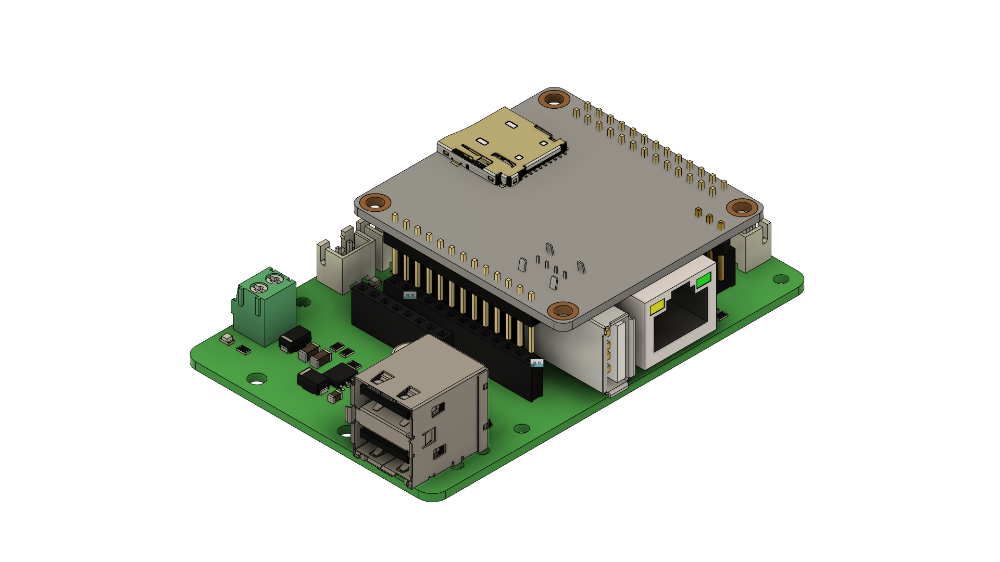
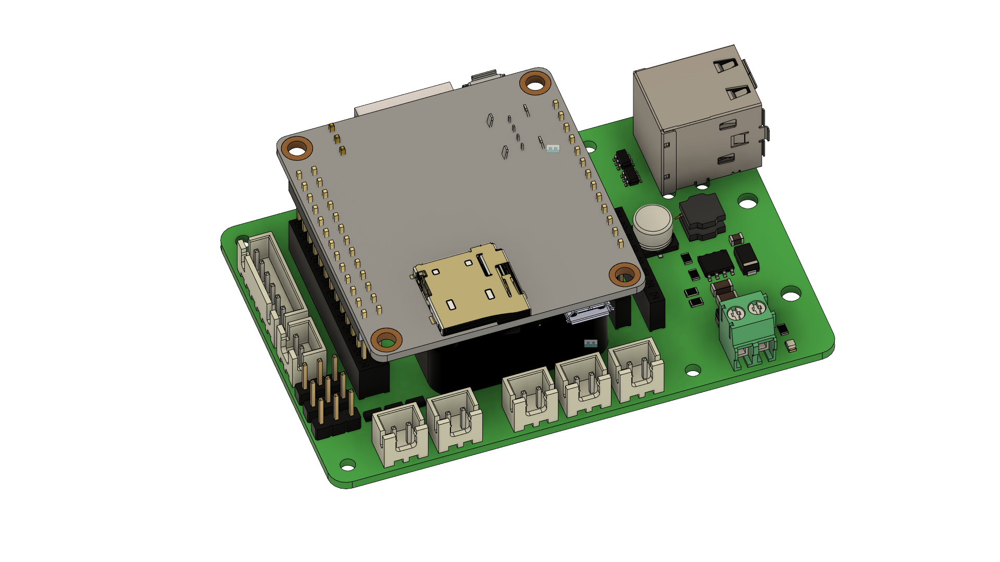

# Before you start
- **(!) Currently version is still under verifying phase, DO NOT use it at this moment! I just upload files here for version control.**
- I'm not a prefesstional electronic engineer, I designed this for fun and convenience while DIY my Voron printer
- You will take it as your own risk for any potential damages
- OrangePi Zero H2+ CPU is being reported has overheat issue, hence a proper cool fan even with cooling fin is strongly recommended
- **(!) Please pay attention for the bold font and description with "(!)"**

# Board Name: Orange Juice
Due to current chipset shortage sitatuion, raspberry pi price increase to an unreasonable level. 
Hence OrangePi Zero become a good alternative. A 25 dollar 512MB ram version meets all the requirments I need as a klipper host for my Voron V0.1, and even little bit over kill.

Klipper has some advance features which need connect to gpio pins, it's not that convenience to use a pin header and connect to gpio pin every time. Instead of that, with this board, it provides easier connection and more useful features:

- A dedicate [ADXL345](https://www.adafruit.com/product/1231) port extend from OrangePi zero SPI1 bus
- A dedicate MAX31865 port connect to 4 gpio pins as a SW SPI connection, for [adafruit MAX31865 board](https://www.adafruit.com/product/3328)
- Two USB2.0 Type A ports from orange pi function pin
- A UART port for UART communication with printer MCU board
- A build in step-down buck converter to convert DC 9~24v input to DC 5v to supply pi and 5v output socket
- Three klipper controllable pwm output ports, voltage depends on input DC voltage
- Two channel persistent 5v output
- A build in 3010 chip cooling fan position
- Raspberry Pi 3B/4 board size and mount hole position compatible 

  

  

  

  

# How to use

## Hardware

## Software

# BOM

